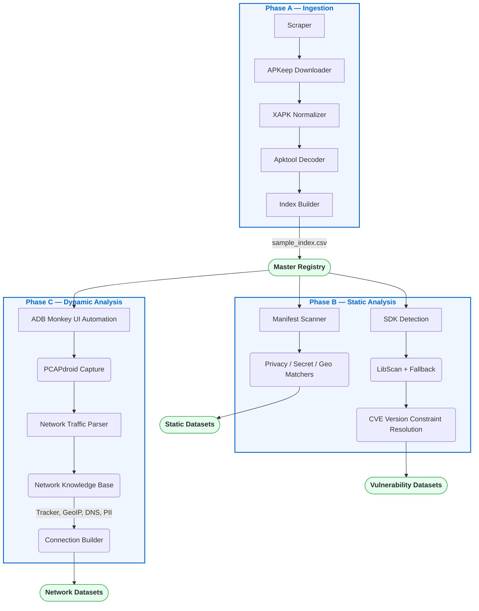

# Geo-Difference Mobile Security Research System

> **Status:** Production-Ready & Frozen for Final Data Collection.  
> **Documentation:** See [`Tracker.md`](Tracker.md) for full project roadmap and task status.

## Abstract

This repository contains the end-to-end static and dynamic analysis pipeline for the **Geo-Difference Mobile Security** project. The system is designed to perform large-scale, automated security and privacy audits of Android applications to study regional disparities across three primary dimensions:

1. **Static Manifest & Code Configurations**: Declarations of permissions, components, custom network security configurations (NSC), and hardcoded privacy API flows.
2. **Vulnerability Landscapes**: Discovery of embedded third-party SDKs and resolution of their versions against the National Vulnerability Database (NVD).
3. **Dynamic Network Behavior**: Automated PCAP capture and deep packet inspection (DPI) to measure tracking telemetry, PII leakage, geographic server hosting, and DNS resolution paths.

---

## 1. Architectural Blueprint

The pipeline operates in three distinct phases: **Ingestion**, **Static Analysis**, and **Dynamic Analysis**.



---

## 2. Core Modules & Knowledge Bases

The system is powered by deterministic Knowledge Bases (`knowledge_base/`) that separate offline intelligence gathering from runtime scanning. See [Knowledge Base README](knowledge_base/docs/README.md) for full architectural details.

### 🔬 Static Analysis Knowledge Base
Evaluates decompiled Smali bytecode and `AndroidManifest.xml` via `MatcherFactory`.
*   **Privacy APIs:** Aho-Corasick automaton tracking 9,300+ Android and GMS APIs (built from Axplorer + PScout).
*   **Hardcoded Secrets:** 700+ regex patterns adapted from TruffleHog.
*   **Geo-Logic Sinks:** FlowDroid rules tracking implicit location-gathering behavior.

### 🌐 PCAP Network Knowledge Base
Enriches raw 6-tuple network connections dynamically via `NetworkContext`.
*   **Tracker Detection:** Longest-suffix domain matcher with 47,000+ rules from Exodus Privacy and EasyPrivacy.
*   **GeoIP Attribution:** Binary IP-to-country and IP-to-ASN resolution via MaxMind GeoLite2.
*   **DNS Resolver Mapping:** O(1) IP resolution to 14 canonical DNS providers using dnscrypt-resolvers.
*   **PII Detection:** Regex + validator engine (Luhn, E.164, RFC standards) tracking IMEI, IPv4, UUID, and Location leaks in HTTP headers, URLs, and DNS names.

### 🛡️ Vulnerability Matching (CVE)
Resolves canonical SDK strings output by LibScan against 25 years of NIST NVD data, mapping version numbers directly to CVE IDs via CPE constraint resolution.

---

## 3. Data Schema & Core Identifiers

All generated output datasets use a universal primary key, enabling relational joins across static and dynamic findings for cross-country statistical analysis.

*   **`sample_id`**: Master key format `{package_name}_{country_code}` (e.g., `com.whatsapp_in`).
*   **`package_name`**: Application identifier.

### Sample Analysis Join
```python
import pandas as pd

# Load structural configurations
manifest_df = pd.read_csv("output/manifest_apps.csv")
# Load vulnerability vectors
cve_df = pd.read_csv("output/cve/app_cve_summary.csv")
# Load runtime network behaviors
pcap_summary_df = pd.read_csv("output/pcap/pcap_app_summary.csv")

# Join on universal key for country-level analysis
merged_dataset = manifest_df.merge(cve_df, on="sample_id").merge(pcap_summary_df, on="sample_id")
```

---

## 4. End-to-End Execution Guide

From the root project directory, run the pipeline stages sequentially:

### Phase A: Environment & App Prep
```powershell
# 1. Target generation
python pipeline/prepare_india_package_list.py

# 2. Authenticated retrieval
python pipeline/download_apks.py --packages data/package_lists/india_packages.txt --source google-play

# 3. File structure normalization
python pipeline/normalize_packages.py

# 4. Decompilation (Apktool)
python pipeline/decode_apks.py

# 5. Registry instantiation
python pipeline/build_sample_index.py --app-store google-play
```

### Phase B: Static Processing
```powershell
# 6. Manifest & Smali Code Scanning
python scan_manifest.py --input-dir decoded/ --output-dir output/manifest/ --sample-index sample_index.csv

# 7. Vulnerability Resolution
python cve/main.py --input-dir decoded/ --output-dir output/cve/ --sample-index sample_index.csv
```

### Phase C: Dynamic Processing
```powershell
# 8. Interactive Capture (Requires connected ADB device)
python collect_pcap.py --capture-time 60 --monkey-events 500

# 9. Headless Packet Analysis & Enrichment
python run_pcap_analysis.py --input-dir data/pcap --output-dir output/pcap --sample-index sample_index.csv
```

---

## 5. Repository Structure

This repository strictly separates production engines from validation scripts and historical research artifacts.

| Path | Purpose |
|------|---------|
| **`cve/`** | NVD JSON feed parser and CPE version-constraint matcher. |
| **`manifest_scanner/`** | Manifest XML parser and Smali bytecode analyzer. |
| **`sdk_detection/`** | LibScan runner, FallbackDetector, and Canonicalizer. |
| **`pcap/`** | DPI packet parser, connection builder, and NetworkContext engine. |
| **`pipeline/`** | Pre-processing scripts (download, normalize, decode, index). |
| **`knowledge_base/`** | Centralized, immutable intelligence definitions (Static + PCAP). |
| **`data/`** | NVD feeds, MaxMind MMDBs, raw PCAPs, and static lists. |
| **`tools/`** | Validation, audit, and benchmark scripts (non-production). |
| **`research_archive/`** | Historical reports generated during Knowledge Base creation. |
| **`docs/`** | Architecture guides, module documentation, and constraint outlines. |

---

> For detailed limitation outlines on the deterministic Knowledge Bases, refer to [`docs/KB_LIMITATIONS.md`](docs/KB_LIMITATIONS.md).
