# 🎯 Project Tracker — Geo-Difference Mobile Security

> [!NOTE]
> **Last Updated:** 17th July 2026  
> **Status Legend:** ✅ Complete · 🔄 In Progress · ⏳ Pending

---

## 📈 1. Overall Progress

| Phase | Module | Description | Status | Reference |
|-------|--------|-------------|--------|-----------|
| **A** | Environment Setup | Android SDK, ADB, Apktool, apkeep, project layout configured | ✅ | [Running Pipeline](docs/RUNNING_PIPELINE.md) |
| **A** | Application Collection | Scraped top-ranked free apps from regional Google Play storefronts via `scrapper.py` | ✅ | [Pipeline README](pipeline/README.md) |
| **A** | APK Acquisition | Downloaded `.apk` and split-APK bundles using apkeep; handles XAPK normalization | ✅ | [Pipeline README](pipeline/README.md) |
| **A** | APK Decompilation | Extracted `AndroidManifest.xml` + Smali bytecode with Apktool 3.0.1 (8-thread, multi-dex) | ✅ | [DEX Guide](docs/DEX_IMPLEMENTATION_GUIDE.md) |
| **A** | Sample Indexing | Generated `sample_id = {package_name}_{country_code}` as universal join key; stored in `sample_index.csv` | ✅ | [Data README](data/README.md) |
| **B** | Knowledge Base Build | Merged Axplorer, PScout, FlowDroid, TruffleHog (700+ patterns), Exodus Privacy, GMS AARs into frozen databases | ✅ | [Knowledge Base README](knowledge_base/README.md) |
| **B** | Manifest Analysis | Extracted permissions, components, exported flags, NSC policies from `AndroidManifest.xml` | ✅ | [Manifest Scanner README](manifest_scanner/README.md) |
| **B** | Privacy API Detection | Aho-Corasick automaton scans Smali for privacy-sensitive API calls from Axplorer + PScout + FlowDroid | ✅ | [Matcher Architecture](knowledge_base/docs/matcher_architecture.md) |
| **B** | Secret Detection | Compiled TruffleHog regexes detect hardcoded API keys, tokens and credentials in source files | ✅ | [Knowledge Enrichment Design](knowledge_base/docs/knowledge_enrichment_design.md) |
| **B** | Geo-Logic Detection | FlowDroid sources/sinks + custom rules detect location-aware and country-discriminatory data flows | ✅ | [Manifest Scanner README](manifest_scanner/README.md) |
| **B** | SDK Detection (LibScan) | LibScan performs fuzzy graph-based bytecode signature matching against LibScout SQLite DB | ✅ | [SDK Detection README](sdk_detection/README.md) |
| **B** | SDK Fallback Detection | `FallbackDetector` uses longest-prefix matching on Manifest + Smali namespaces for LibScan misses | ✅ | [SDK Detection README](sdk_detection/README.md) |
| **B** | SDK Canonicalization | Resolves raw SDK names to canonical IDs, collapses sub-brands, eliminates duplicates | ✅ | [SDK Detection README](sdk_detection/README.md) |
| **B** | Tracker Enrichment | Deterministic longest-suffix domain match against Exodus Privacy database for tracker attribution | ✅ | [SDK Detection README](sdk_detection/README.md) |
| **B** | CVE Matching | Maps detected SDK version strings to NVD CVE records via CPE version constraint resolution | ✅ | [CVE Overview](cve/CVE_Analysis_Overview.md) |
| **C** | ADB Automation | Automated APK install, Monkey UI exerciser (500 events), force-stop and uninstall per sample | ✅ | [PCAP README](pcap/README.md) |
| **C** | PCAP Collection | PCAPdroid captures per-app traffic (60s) filtered to target package; pulled via ADB to `data/pcap/` | ✅ | [PCAP README](pcap/README.md) |
| **C** | Packet Parsing | `pcap_parser.py` decodes raw frames via dpkt; extracts DNS, TLS SNI, HTTP Host, QUIC per packet | 🔄 | [PCAP README](pcap/README.md) |
| **C** | Connection Aggregation | `connection_builder.py` aggregates `RawEvent` streams into 6-tuple `ConnectionRecord` fact tables | 🔄 | [PCAP README](pcap/README.md) |
| **C** | GeoIP Attribution | `GeoMapper` resolves destination IPs to country code + ASN; single in-process LRU cache | 🔄 | [PCAP README](pcap/README.md) |
| **C** | HTTPS Interception (Burp) | Payload decryption requires custom CA cert injection into Android root certificate store | 🔄 | *(No file yet — see §7)* |
| **D** | Dataset Integration | Merge all output CSVs into one unified dataset joined on `sample_id` | ⏳ | — |
| **D** | Statistical Analysis | Cross-country SDK, tracker, CVE and network endpoint comparison | ⏳ | — |
| **D** | Visualization | Charts, heatmaps, geographic plots for thesis figures | ⏳ | — |
| **D** | Thesis / Research Paper | Methodology, experimental setup, results and discussion | ⏳ | — |

---

## 🏛️ 2. Repository Architecture

```text
Geo-Difference_MobileSecurity/
│
├── 🔬 Production Engines (Never Move)
│   ├── cve/                 NVD CVE loader + version-constraint matcher
│   ├── manifest_scanner/    Manifest XML parser + Smali static analysis engine
│   ├── sdk_detection/       LibScan runner + fallback + canonicalization + enrichment
│   ├── pcap/                Packet parser + connection builder + GeoIP + app summary
│   ├── pipeline/            APK scraping → download → normalize → decode → index
│   └── knowledge_base/      Frozen Aho-Corasick automata + privacy rule databases
│
├── 🗄️ Data & Dependencies
│   ├── data/                NVD feeds (2002–2026), GeoIP, package lists, raw PCAPs
│   └── third_party/         LibScan binary + LibScout SQLite reference database
│
├── 🧪 Validation
│   └── tools/validation/    Audit, benchmark and comparison scripts (not production)
│
├── 📦 Archive
│   └── research_archive/    Historical build reports, benchmarks, legacy wrappers
│
└── 📖 Documentation
    ├── docs/                 Architecture, repository rules, DEX guide
    ├── README.md             Project entry point
    ├── CONTRIBUTING.md       Contributor guidelines and layout rules
    └── Tracker.md            This file
```

| Folder | Description | Reference |
|--------|-------------|-----------|
| `cve/` | Loads 25 years of NVD ZIP feeds; tokenizes SDK names; resolves CPE version constraints to CVE IDs | [CVE Overview](cve/CVE_Analysis_Overview.md) |
| `manifest_scanner/` | Parses `AndroidManifest.xml`; scans Smali via unified `MatcherFactory` (PrivacyMatcher, SecretMatcher, GeoMatcher) | [Manifest README](manifest_scanner/README.md) |
| `sdk_detection/` | 4-stage pipeline: LibScan → FallbackDetector → Canonicalizer → TrackerEnricher → MetadataLoader | [SDK README](sdk_detection/README.md) |
| `pcap/` | Parses raw `.pcap` via dpkt into `RawEvent`; builds 6-tuple `ConnectionRecord`; computes per-app `AppSummary` | [PCAP README](pcap/README.md) |
| `pipeline/` | Corpus curation → apkeep download → XAPK normalization → Apktool decode → SHA-256 sample index | [Pipeline README](pipeline/README.md) |
| `knowledge_base/` | Synthesizes Axplorer, PScout, FlowDroid, TruffleHog, Exodus, GMS into frozen automata + lookup tables | [KB README](knowledge_base/README.md) |
| `data/` | `nvd/` (static, versioned), `package_lists/` (dynamic), `pcap/` (dynamic, gitignored) | [Data README](data/README.md) |
| `tools/validation/` | Developer scripts for auditing and benchmarking; must never be imported by production code | — |
| `research_archive/` | Read-only historical reports from knowledge base build phase (Axplorer, Exodus, TruffleHog imports) | [Archive README](research_archive/README.md) |
| `docs/` | Architecture guide, structural rules, dataset references and DEX implementation guide | [Architecture](docs/ARCHITECTURE.md) |

> [!TIP]
> Full structural policy → [Repository Structure](docs/REPOSITORY_STRUCTURE.md)

---

## 📊 3. Generated Output Datasets

| # | Output File | What It Contains | Schema Details |
|---|-------------|-----------------|----------------|
| **1** | `sample_index.csv` | Master registry: `sample_id`, `package_name`, `country_code`, `apk_sha256`, `app_store` | [Data README](data/README.md) |
| **2** | `manifest_apps.csv` | One row per app: aggregated feature vector (permission counts, SDK count, security flags) | [App Summary Dataset](manifest_scanner/dataset_details/App_Summary_Dataset_Overview.md) |
| **3** | `manifest_permissions.csv` | All declared Android permissions per app with family classification | [Permission Dataset](manifest_scanner/dataset_details/Permission_Dataset_Overview.md) |
| **4** | `manifest_components.csv` | Activities, Services, Receivers, Providers + `android:exported` flags | [Component Dataset](manifest_scanner/dataset_details/Component_Dataset_Overview.md) |
| **5** | `manifest_network_domains.csv` | Cleartext domains, custom NSC overrides, user-cert policies | [NSC Dataset](manifest_scanner/dataset_details/NSC_Dataset_Overview.md) |
| **6** | `manifest_sdks.csv` | Detected SDKs: canonical name, vendor, tracker flag, Exodus category, detection method | [SDK Dataset](manifest_scanner/dataset_details/SDK_Dataset_Overview.md) |
| **7** | `static_code_findings.csv` | Hardcoded secrets, privacy API sinks, geo-logic flows found in Smali | [Findings Dataset](manifest_scanner/dataset_details/Static_Code_Findings_Dataset_Overview.md) |
| **8** | `sdk_cve_matches.csv` | CVE-ID → SDK version matches with CVSS score and vector string | [CVE Overview](cve/CVE_Analysis_Overview.md) |
| **9** | `cve_coverage_report.csv` | SDKs evaluated but not matched (coverage audit trail) | [CVE Overview](cve/CVE_Analysis_Overview.md) |
| **10** | `app_cve_summary.csv` | Per-app CVE count, max CVSS, critical/high/medium breakdown | [CVE Overview](cve/CVE_Analysis_Overview.md) |
| **11** | `pcap_connections.csv` | 6-tuple connection records: `(sample_id, session_id, domain, dst_ip, port, protocol)` + GeoIP + tracker | [PCAP README](pcap/README.md) |
| **12** | `pcap_dns.csv` | DNS queries/responses, resolver IPs, hardcoded-resolver and DoH flags | [PCAP README](pcap/README.md) |
| **13** | `pcap_domain_geo.csv` | Domain → IP → country + ASN resolution table | [PCAP README](pcap/README.md) |
| **14** | `pcap_app_summary.csv` | Per-app aggregate: unique countries, trackers, TLS ratio, top ASN, hardcoded DNS flag | [PCAP README](pcap/README.md) |

---

## 🛠️ 4. External Datasets & Tools

| Dataset / Tool | What It Does in This Project | Status | Reference |
|----------------|------------------------------|--------|-----------|
| **Google Play Scraper** | Queries Play by country + category; outputs `top_apps_full.csv` ranked by install count | ✅ | [Pipeline README](pipeline/README.md) |
| **apkeep (EFF)** | CLI tool that authenticates against Play Store and fetches APK/split-APK bundles without root | ✅ | [External Datasets](docs/external_datasets_and_tools.md) |
| **Apktool 3.0.1** | Disassembles DEX bytecode → Smali; decodes binary `AndroidManifest.xml` → readable XML | ✅ | [DEX Guide](docs/DEX_IMPLEMENTATION_GUIDE.md) |
| **LibScan** | Runs fuzzy graph-based bytecode matching via a chunked JVM subprocess against LibScout SQLite DB | ✅ | [SDK README](sdk_detection/README.md) |
| **LibScout SQLite DB** | Reference database of compiled Android library signatures used by LibScan | ✅ | [SDK README](sdk_detection/README.md) |
| **NVD (NIST)** | 25 annual JSON 2.0 ZIP feeds (2002–2026) with CPE-based version constraints; ~2.5 GB uncompressed | ✅ | [CVE Overview](cve/CVE_Analysis_Overview.md) |
| **Exodus Privacy** | Tracker domain and package-prefix database; 400+ trackers; used for longest-suffix enrichment | ✅ | [Tracker Report](research_archive/knowledge_base/tracker_enricher_report.md) |
| **Axplorer** | Maps Android API methods → permissions; used to populate `PrivacyMatcher` knowledge | ✅ | [Axplorer Report](research_archive/knowledge_base/axplorer_validation_report.md) |
| **PScout** | Alternative API → permission mapping for cross-validation with Axplorer | ✅ | [PScout Report](research_archive/knowledge_base/pscout_validation_report.md) |
| **FlowDroid Sources/Sinks** | Defines privacy-sensitive data sources (location, contacts) and geo-aware sink points | ✅ | [Geo Report](research_archive/knowledge_base/flowdroid_geo_report.md) |
| **TruffleHog Patterns** | 700+ compiled regex detectors for hardcoded API keys, tokens, credentials (from open-source ruleset) | ✅ | [TruffleHog Report](research_archive/knowledge_base/trufflehog_import_report.md) |
| **Google Play Services AARs** | Android framework binaries used as baseline SDK signature references in LibScout DB | ✅ | [GMS Report](research_archive/knowledge_base/gms_validation_report.md) |
| **PCAPdroid** | On-device Android app; captures per-app traffic filtered by UID; exports raw `.pcap` files | ✅ | [PCAP README](pcap/README.md) |
| **MaxMind GeoLite2** | IP-to-country + ASN database used by `GeoMapper`; single in-process LRU cache | ✅ | [External Datasets](docs/external_datasets_and_tools.md) |
| **Burp Suite** | HTTPS proxy for TLS interception; requires custom CA cert injection into Android trust store | 🔄 | *(No file yet — see §7)* |

---

## ⚙️ 5. Pipeline Workflow

```mermaid
flowchart TD
    %% Styling
    classDef phase fill:#f0f6ff,stroke:#0366d6,stroke-width:2px,color:#0366d6,font-weight:bold
    classDef file fill:#f6f8fa,stroke:#d1d5da,stroke-dasharray: 5 5,color:#24292e
    classDef output fill:#e6ffed,stroke:#28a745,color:#24292e,font-weight:bold

    %% Phase A
    subgraph Phase_A [Phase A — Ingestion]
        direction TB
        A1[Scraper] -->|Output: top_apps_full.csv| A2[prepare_package_list.py]
        A2 -->|Output: target_packages.txt| A3[download_apks.py]
        A3 -->|Output: apks/| A4[normalize_packages.py]
        A4 -->|Output: normalized/| A5[decode_apks.py]
        A5 -->|Output: decoded/| A6[build_sample_index.py]
    end
    class Phase_A phase
    
    A6 -->|Outputs JOIN KEY| O1([sample_index.csv])
    class O1 output

    %% Phase B
    subgraph Phase_B [Phase B — Static Analysis]
        direction TB
        B1[scan_manifest.py]
        B2[sdk_detection]
        
        B1 --> B1a(PrivacyMatcher)
        B1 --> B1b(SecretMatcher)
        B1 --> B1c(GeoMatcher)
        
        B2 --> B2a(LibScanRunner)
        B2 --> B2b(FallbackDetector)
        B2b --> B2c(Canonicalizer & Enricher)
        
        B3[cve/main.py] --> B3a(NVD Constraint Matcher)
    end
    class Phase_B phase

    O1 --> B1
    O1 --> B2
    B2c --> B3
    
    B1c --> O2([manifest_features.csv, etc.])
    B3a --> O3([sdk_cve_matches.csv])
    class O2,O3 output

    %% Phase C
    subgraph Phase_C [Phase C — Dynamic Analysis]
        direction TB
        C1[collect_pcap.py] -->|ADB Monkey| C2(PCAPdroid Capture)
        C2 -->|Output: data/pcap/| C3[run_pcap_analysis.py]
        C3 --> C3a(pcap_parser)
        C3 --> C3b(connection_builder)
        C3 --> C3c(geoip + summary)
    end
    class Phase_C phase

    O1 --> C1
    C3c --> O4([pcap_connections.csv, etc.])
    class O4 output

    %% Phase D
    subgraph Phase_D [Phase D — Analysis & Reporting]
        direction TB
        D1[Dataset Integration] --> D2[Statistical Analysis]
        D2 --> D3[Visualization]
        D3 --> D4[Thesis / Paper]
    end
    class Phase_D phase

    O2 --> D1
    O3 --> D1
    O4 --> D1
```



---

## 🎛️ 6. Design Decisions & Hardcoded Configuration

| Parameter | Value | Source / Rationale |
|-----------|-------|-------------------|
| **PCAP capture duration** | `60 seconds` | Sufficient for background SDK traffic to initialize |
| **Monkey UI events** | `500` | Balances app interaction coverage vs. execution time per device |
| **LibScan chunk size** | `Auto` *(IPC buffer limit)* | Prevents `MemoryError` when scanning 400+ library DB |
| **Smali scan directories** | `smali/`, `smali_classes2/` … | Multi-dex APK support |
| **Tracker matching** | `Longest-suffix domain match` | Zero false positives; no heuristics |
| **LibScan priority** | `LibScan > FallbackDetector` | Bytecode signatures more accurate than string prefix |
| **Private IP exclusions** | `10.0/8`, `192.168/16`, `127.0/8` … | Exclude local routing hops from GeoIP country analysis |
| **Sample identity key** | `{package}_{country}` = `sample_id` | Clean, human-readable join key across all 14 output datasets |
| **SDK canonicalization** | `sdk_metadata.csv` alias map | Prevents double-counting Google sub-SDKs (Maps, Firebase, etc.) |
| **TruffleHog patterns** | `700+ regex rules` | Covers AWS, GCP, Azure, Stripe, Twilio, GitHub tokens |
| **NVD coverage** | `2002–2026` (25 ZIP feeds) | Full historical CVE catalog for maximum recall |
| **GeoIP cache** | `In-process LRU dict` | No secondary caches; eliminates dual-source-of-truth bugs |

---

## 🚧 7. Remaining Tasks

### 🔄 In Progress

| Task | Blocker / Notes |
|------|----------------|
| **HTTPS traffic decryption (Burp Suite)** | Requires custom CA cert injection into Android root store; PCAPdroid captures only raw encrypted packets |
| **Network Traffic Analysis finalization** | Individual PCAP CSVs generated; final JOIN + country-level aggregation pending |

### ⏳ Pending — Data Processing

| Task |
|------|
| Merge `manifest_apps.csv`, `manifest_sdks.csv`, `manifest_permissions.csv`, `pcap_app_summary.csv`, `app_cve_summary.csv` on `sample_id` |
| Validate merged dataset: check for missing `sample_id`, duplicates and null CVSSs |
| Feature engineering: derive ratios (tracker_pct, tls_pct, high_risk_country_pct) |

### ⏳ Pending — Statistical Analysis

| Research Question | Analysis |
|-------------------|----------|
| **Do India-targeted apps embed more trackers?** | Tracker count distribution by country |
| **Which permissions are India-exclusive vs. global?** | Permission frequency heatmap |
| **How does CVE severity differ by market?** | CVE CVSS distribution comparison |
| **Which countries host the most app endpoints?** | Network hosting concentration by country code |
| **TLS adoption rates across markets** | TLS vs. cleartext connection ratio per country |
| **SDK ecosystem differences** | SDK vendor market-share comparison |

### ⏳ Pending — Visualization

| Figure | Type |
|--------|------|
| Tracker prevalence by country | 📊 Grouped bar chart |
| Permission usage heatmap | 🗺️ Matrix heatmap (permission × country) |
| Network hosting concentration | 🌍 Choropleth / geographic map |
| CVE severity breakdown | 🚥 Stacked bar chart (Critical/High/Medium/Low) |
| TLS vs. cleartext ratio | 🥧 Grouped bar or pie per country |
| Top SDK vendors by market | 📉 Treemap or ranked bar |

### ⏳ Pending — Documentation

| Document | Suggested Path |
|----------|---------------|
| Methodology | `docs/METHODOLOGY.md` *(create later)* |
| Experimental Setup | `docs/EXPERIMENTAL_SETUP.md` *(create later)* |
| Results & Discussion | `docs/RESULTS.md` *(create later)* |
| Final Research Paper | — |

---

## 🗄️ 8. Research Archive

Historical validation reports generated during the knowledge base build phase:

| Report | What It Covers | Link |
|--------|----------------|------|
| **Aho-Corasick Benchmark** | Performance comparison of multi-pattern automaton vs. linear regex on large Smali corpora | [aho_benchmark_report.md](research_archive/knowledge_base/aho_benchmark_report.md) |
| **Axplorer Validation** | API-to-permission coverage and import accuracy from Axplorer dataset | [axplorer_validation_report.md](research_archive/knowledge_base/axplorer_validation_report.md) |
| **Database Freeze Report** | Final frozen state of all synthesized privacy rule and tracker databases | [database_freeze_report.md](research_archive/knowledge_base/database_freeze_report.md) |
| **Dataset Comparison** | Side-by-side comparison of Axplorer vs. PScout coverage on real APK corpus | [dataset_comparison.md](research_archive/knowledge_base/dataset_comparison.md) |
| **Exodus Dataset Summary** | Tracker count, domain coverage and deduplication statistics after Exodus import | [exodus_dataset_summary.md](research_archive/knowledge_base/exodus_dataset_summary.md) |
| **GeoMatcher Report** | Accuracy of FlowDroid-based geo-logic detection on sample APKs | [geo_matcher_report.md](research_archive/knowledge_base/geo_matcher_report.md) |
| **GMS Validation Report** | Validation of Google Play Services AAR integration as SDK reference | [gms_validation_report.md](research_archive/knowledge_base/gms_validation_report.md) |
| **Privacy DB Validation** | End-to-end correctness of merged privacy rule database | [privacy_database_validation.md](research_archive/knowledge_base/privacy_database_validation.md) |
| **PScout Validation** | Coverage and recall of PScout API mapping against Axplorer baseline | [pscout_validation_report.md](research_archive/knowledge_base/pscout_validation_report.md) |
| **SDK Pipeline Final Report** | End-to-end accuracy + recall metrics across LibScan + Fallback pipeline | [sdk_pipeline_final_report.md](research_archive/knowledge_base/sdk_pipeline_final_report.md) |
| **System Validation Report** | Integration test results across the full static analysis pipeline | [system_validation_report.md](research_archive/knowledge_base/system_validation_report.md) |
| **Tracker Enricher Report** | Accuracy of deterministic longest-suffix Exodus tracker matching | [tracker_enricher_report.md](research_archive/knowledge_base/tracker_enricher_report.md) |
| **TruffleHog Import Report** | Coverage of 700+ regex patterns after TruffleHog ruleset import | [trufflehog_import_report.md](research_archive/knowledge_base/trufflehog_import_report.md) |

> [!TIP]
> Full list → [Research Archive README](research_archive/README.md)

---

## 📌 9. Current Status Summary

| Component | Detail | Status |
|-----------|--------|--------|
| **Data Acquisition Pipeline** | Scrape → Download → Normalize → Decode → Index | ✅ Complete |
| **Manifest Analysis Engine** | XML parse + Smali scan (8051 files/app, ~4s) | ✅ Complete |
| **SDK Detection — LibScan** | Chunked JVM bytecode signature matching | ✅ Complete |
| **SDK Detection — Fallback** | Longest-prefix Manifest + Smali namespace scan | ✅ Complete |
| **SDK Canonicalization & Enrichment**| Exodus tracker enrichment + vendor metadata | ✅ Complete |
| **Privacy & Secret Detection** | Aho-Corasick automaton + TruffleHog 700+ regexes | ✅ Complete |
| **Geo-Logic Detection** | FlowDroid source/sink scanning | ✅ Complete |
| **CVE Matching** | NVD 2002–2026 → CPE version constraint resolution | ✅ Complete |
| **PCAP Collection** | PCAPdroid per-app 60s capture via ADB | ✅ Complete |
| **Network Traffic Analysis** | DNS + TLS SNI + GeoIP + tracker parsing | 🔄 In Progress |
| **HTTPS Traffic Interception** | Burp Suite CA injection + payload decryption | 🔄 In Progress |
| **Repository Freeze & Docs** | Clean structure, linked docs, CONTRIBUTING.md | ✅ Complete |
| **Dataset Integration** | Unified CSV merge on `sample_id` | ⏳ Pending |
| **Statistical Analysis** | Cross-country comparison + hypothesis testing | ⏳ Pending |
| **Visualization** | Figures for thesis | ⏳ Pending |
| **Thesis / Paper** | Final writeup | ⏳ Pending |