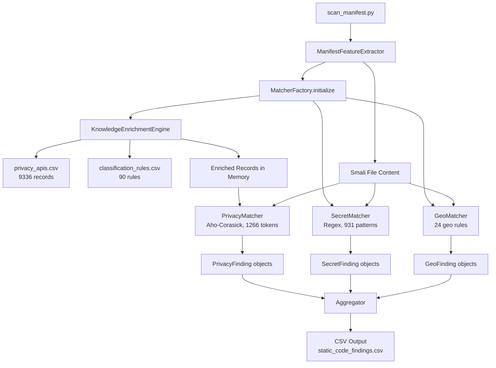

# Knowledge Base: Complete Technical Overview

This document is the authoritative reference for the `knowledge_base` module. It covers every external dataset used, what data is extracted, how it is imported and merged, how the merged database is searched inside APKs, and why each algorithm was chosen.

---

## 1. Module Purpose

The `knowledge_base` module serves two entirely separate responsibilities that must not be confused:

| Phase | When it runs | Purpose |
|---|---|---|
| **Build Pipeline** | Offline, once | Parse external academic/security datasets, normalize and merge them into canonical CSVs |
| **Runtime Engine** | Every APK scan | Load frozen canonical CSVs, enrich them in-memory, and execute high-performance pattern matching on Smali bytecode |

The production runtime **never** touches raw upstream sources. It operates exclusively on the frozen metadata files produced by the build pipeline.

---

## 2. External Datasets

### 2.1 Axplorer
**What it is:** A research dataset mapping Android permission system APIs. It was constructed by statically analyzing the Android Open Source Project (AOSP) framework to exhaustively identify which SDK methods require which permissions.

**What we extract:**
- Java package name (`android.location`, `android.hardware`, etc.)
- Class name (`LocationManager`, `SensorManager`, etc.)
- Method name (`getLastKnownLocation`, `requestUpdates`, etc.)
- Required Android permission (`android.permission.ACCESS_FINE_LOCATION`, etc.)
- API type (`method`, `field`, `constructor`)
- Android API level support range

**How we extract it:** `knowledge_base/importers/import_axplorer.py` reads the raw Axplorer XML configuration files from `knowledge_base/raw/axplorer/`. Each permission mapping entry is parsed and normalized. During normalization, the importer:
1. Loads the permission-to-privacy-category taxonomy from `metadata/android_permission_groups.csv` and `metadata/group_to_privacy_category.csv`.
2. Resolves each permission to its standardized privacy category (e.g., `ACCESS_FINE_LOCATION` → `Location → GPS`).
3. Produces typed `PrivacyAPIRecord` objects and writes them to `build_outputs/axplorer_import.csv`.

**Why Axplorer:** It provides the highest-fidelity, exhaustively complete mapping of Android's permission surface. Unlike documentation scraping, Axplorer's mappings were derived by static analysis of the actual AOSP bytecode.

---

### 2.2 PScout
**What it is:** An alternative Android permission dataset built using a Datalog-based static analysis of AOSP. PScout and Axplorer were developed independently and use different analysis methodologies, making their intersection highly trustworthy.

**What we extract:** Same schema as Axplorer — package, class, method, permission, API level range.

**How we extract it:** `knowledge_base/importers/import_pscout.py` reads PScout's raw output from `knowledge_base/raw/pscout/config/`. PScout records are normalized through the same permission-taxonomy resolution pipeline as Axplorer. Output is written to `build_outputs/pscout_import.csv`.

**Why PScout alongside Axplorer:** Having two independent analyses of the same AOSP permission surface enables provenance tracking. APIs confirmed by both Axplorer and PScout receive stronger confidence scores. Exclusive APIs from each dataset are still retained to maximize coverage.

---

### 2.3 Google Play Services (GMS)
**What it is:** The Google Mobile Services SDK provides APIs beyond AOSP — specifically the Google Location APIs, Maps SDK, Fused Location Provider, and other proprietary Google services heavily used by commercial Android apps.

**What we extract:**
- Class and method signatures from GMS SDK JARs
- Privacy-sensitive groupings (Fused Location, Activity Recognition, Awareness API, etc.)

**How we extract it:** `knowledge_base/importers/import_gms.py` uses the `jawa` library to decompile GMS JARs into classfiles and inspect their method signatures. The importer reads a curated metadata index (`metadata/gms_artifacts.csv`) listing which GMS artifacts to import. For each artifact, it:
1. Decompiles the JAR using `jawa.cf.ClassFile`.
2. Extracts all public method signatures.
3. Maps them to privacy categories using the GMS artifact groupings.
4. Emits typed `PrivacyAPIRecord` objects to `build_outputs/gms_import.csv`.

**Why GMS separately:** GMS APIs are closed-source and not present in AOSP. Apps frequently use `com.google.android.gms.location.*` instead of the standard `android.location.*` APIs. Without GMS coverage, the scanner would miss most location detection in commercial apps.

---

### 2.4 TruffleHog
**What it is:** An open-source secrets-scanning engine that ships an exhaustive library of 931 regex rules for detecting hardcoded API keys, OAuth tokens, private keys, and service credentials. Each rule targets a specific provider (e.g., AWS, Stripe, Twilio, Firebase).

**What we extract:**
- Pattern ID (`pattern_id`)
- Provider name (e.g., `aws_access_key`)
- Secret type description
- Raw regex string (Google RE2 dialect)
- Severity level

**How we extract it:** `knowledge_base/pipeline/importers/import_trufflehog.py` reads the TruffleHog rule files, normalizes each rule into a `SecretPattern` record, and writes them to `metadata/secret_patterns.csv`. During import, patterns that use RE2 syntax unsupported by Python's `re` engine (e.g., `\z` anchors, inline `(?i)` modifiers mid-pattern) are flagged as `supported=False` but retained in the database for traceability.

**Why TruffleHog:** It is the industry standard for secrets detection with the broadest provider coverage and a publicly auditable rule set. Building an equivalent rule library from scratch would be infeasible for this research scope.

---

### 2.5 FlowDroid Geo-Logic Rules
**What it is:** FlowDroid is a precise static taint analysis framework for Android. Its configuration ships rule files identifying geo-inference API call chains — sequences of method calls that can be used to infer a device's physical location even without explicit GPS permission (e.g., by combining SSID scanning, cell tower data, or barometric pressure readings).

**What we extract:**
- Rule ID
- API call pattern (Java method signature or regex)
- Privacy category (`Location`, `Sensor`, etc.)
- Subcategory (`Cell Tower`, `WiFi SSID`, `Barometric`, etc.)
- Confidence level

**How we extract it:** `knowledge_base/pipeline/importers/import_flowdroid_geo.py` reads FlowDroid rule files and transpiles Java-style method patterns into Python-compatible regex patterns. Output is written to `metadata/geo_logic.csv`.

**Why FlowDroid:** Standard permission analysis cannot detect apps that use indirect geo-inference. An app reading barometric pressure and cell signal strength without `ACCESS_FINE_LOCATION` can still triangulate location. FlowDroid's rules encode this attack surface explicitly.

---

## 3. The Merge Pipeline

After the five source importers have generated their intermediate CSVs, all privacy API data is consolidated into a single canonical database.

### 3.1 Database Merger (`merge_database.py`)

**Input files:**
- `build_outputs/axplorer_import.csv`
- `build_outputs/pscout_import.csv`
- `build_outputs/gms_import.csv`

**Output file:**
- `processed/privacy_apis.csv` ← The Single Source of Truth

**Merge algorithm:**

```
1. Load all three source CSVs as PrivacyAPIRecord lists.
2. For each record, generate a canonical deduplication key:
     key = (package_name, class_name, method_name, api_type)
3. If the key already exists:
     a. Merge the `sources` list (tracking which datasets contributed).
     b. Merge `source_versions` lists.
     c. Resolve confidence: if multi-source, boost to the higher confidence.
     d. Resolve category: if sources agree → keep. If they disagree → retain Axplorer value, log conflict.
4. If the key is new: generate a UUID record_id and store.
5. Write final de-duplicated records to privacy_apis.csv.
6. Write merge_statistics.csv to processed/ (row counts, overlap counts).
```

The merge is **deterministic** — given the same input CSVs, the same `privacy_apis.csv` is produced every time. UUID generation is seeded from the canonical deduplication key, not from random state.

**Result:** 9,336 canonical privacy API records covering AOSP permissions, GMS proprietary APIs, and cross-validated overlap entries.

---

## 4. The Runtime Engine

When `scan_manifest.py` is executed, the runtime engine loads, enriches, and activates three specialized matchers. No raw data sources are read at runtime — only the frozen canonical CSVs.

### 4.1 Knowledge Enrichment Engine (`knowledge_enrichment.py`)

The canonical `privacy_apis.csv` database intentionally stores raw provenance data without inferring semantic meaning. Many records arrive from Axplorer with `category = "Unknown"` because their Android permission could not be resolved to a single privacy category. The Enrichment Engine resolves this before the matchers activate.

**Input files:**
- `processed/privacy_apis.csv` (read-only, immutable)
- `metadata/classification_rules.csv` (90 hand-curated rules)

**How it works:**

```
1. Load classification_rules.csv. Parse into four rule dictionaries:
   - method_rules:  { "pkg.Class.method" → [rules] }
   - class_rules:   { "pkg.Class"        → [rules] }
   - package_rules: { "pkg"              → [rules] }
   - keyword_rules: [ (compiled_regex, rule), ... ]

2. For each API record:
   a. Apply method rule → if match, enrich category/subcategory/confidence.
   b. Else apply class rule.
   c. Else apply package rule.
   d. Else apply keyword regex search over full method signature.
   e. No matching rule → record retains its existing canonical values.

3. Conflict resolution (if multiple rules at the same level match):
   - If all rules agree on category/subcategory → apply.
   - If rules disagree → do NOT enrich, append CONFLICT annotation to notes.

4. Return enriched PrivacyAPIRecord objects IN MEMORY ONLY.
   The canonical privacy_apis.csv file is never modified.
```

**Rule priority (specificity cascade):**
`Method > Class > Package > Keyword`

An exact method-level match always overrides a broader package-level rule. This prevents false positive enrichment from overly broad package rules.

**Why in-memory only:** Persisting an "enriched" database would violate the single-source-of-truth principle. The enriched database would diverge from the canonical one every time `classification_rules.csv` is updated, requiring a re-run with a fresh copy. The in-memory approach makes enrichment instantaneous and the canonical database truly immutable.

---

### 4.2 Privacy Matcher — Aho-Corasick (`aho_matcher.py`)

**What it detects:** Privacy API usage in Smali bytecode (e.g., calls to `LocationManager.getLastKnownLocation`, `SensorManager.registerListener`).

**Algorithm: Aho-Corasick multi-pattern string search**

The Aho-Corasick algorithm builds a finite-state automaton from a dictionary of N pattern strings. After a one-time O(total pattern length) build step, every search runs in O(text length + number of matches) time — independent of N. This is critical because the dictionary contains 1,266 unique patterns and the scanner processes thousands of Smali files per APK.

**Build phase:**
```
1. For each enriched PrivacyAPIRecord:
   a. Skip records with category = "Unknown" (unclassified).
   b. Generate a search token:
      - If has class + method: "ClassName.methodName"
      - If <init>:             "ClassName"
      - If class only:         "ClassName"
      - If package only:       last package segment
   c. Normalize token to lowercase.
   d. Add token → (category, subcategory, confidence) to automaton.
2. De-duplicate: if the same token maps to multiple (category, subcategory) pairs,
   retain all unique pairs.
3. Call automaton.make_automaton() to compile failure links.
Result: 1,266 unique lowercased tokens in the automaton.
```

**Search phase (per Smali file):**
```
1. Lowercase the input text.
2. Stream through the automaton using iter() — O(N) in text length.
3. For each match position, record all associated (category, subcategory) pairs.
4. De-duplicate findings by (category, subcategory, token) to avoid repeated matches.
5. Sort deterministically by (category, subcategory, matched_text).
6. Return list of PrivacyFinding objects.
```

**Why Aho-Corasick over regex alternation:** A naive regex alternation (`pattern1|pattern2|...|pattern1266`) requires backtracking and degrades to O(N × P) in the worst case. Aho-Corasick guarantees O(N) regardless of pattern count and is therefore the only viable choice for scanning large Smali corpora at research scale.

---

### 4.3 Secret Matcher — Regex Engine (`secret_matcher.py`)

**What it detects:** Hardcoded API keys, OAuth tokens, private keys, and service credentials embedded in Smali string literals.

**Algorithm: Pre-compiled regex set**

Unlike the Privacy Matcher which looks for structured API signatures, secrets are unstructured and highly variable. They must be detected via regular expressions provided by TruffleHog.

**Build phase:**
```
1. Load metadata/secret_patterns.csv.
2. For each pattern:
   a. Attempt to compile the raw regex with Python's re module.
   b. If compilation succeeds: mark pattern as supported=True.
   c. If compilation fails (RE2 syntax not supported by Python re):
      mark pattern as supported=False, retain in database.
3. Log compile statistics. Write unsupported patterns to processed/.
Result: 931 patterns loaded, subset compiled successfully.
```

**Search phase (per file):**
```
1. For each supported compiled pattern:
   a. Call compiled_regex.finditer(text).
   b. For each match: emit SecretFinding with provider, secret_type, severity,
      matched_text, and offset.
2. Return all findings.
```

**Note on RE2 vs Python `re`:** TruffleHog's rules were authored for Google's RE2 engine which supports `\z` (absolute end-of-string), possessive quantifiers, and inline modifiers mid-pattern. Python's `re` engine does not support these constructs. Patterns using them are stored in the canonical database but excluded from runtime matching via the `supported` flag. This fault-tolerant design prevents a single incompatible rule from crashing the scanner.

---

### 4.4 Geo Matcher — Compiled Rule Set (`geo_matcher.py`)

**What it detects:** Calls to indirect geo-inference APIs — methods that can reveal physical location without `ACCESS_FINE_LOCATION` (e.g., cell tower signal, WiFi SSID scanning, barometric pressure, accelerometer patterns).

**Algorithm: Rule-based regex scan**

**Build phase:**
```
1. GeoRuleLoader.load_rules() reads metadata/geo_logic.csv.
2. For each rule, compile the pattern string into a Python regex.
3. Unsupported patterns (invalid regex) are flagged with supported=False.
Result: 24 active geo-inference rules.
```

**Search phase:**
```
1. For each supported rule, run compiled_pattern.finditer(text).
2. For each match: emit GeoFinding with rule_id, category, subcategory, confidence.
3. Return all findings.
```

**Why a separate matcher:** Geo-inference is categorically distinct from permission API usage. It requires pattern rules derived from FlowDroid's taint configuration rather than AOSP permission mappings. Keeping it separate allows researchers to independently update geo-logic rules without touching the privacy API database.

---

### 4.5 Matcher Factory and Cache Manager

**`MatcherFactory`** is the entry point for the entire detection engine. It is called once by `ManifestFeatureExtractor` during scanner startup.

**`CacheManager`** is a module-level singleton dictionary that ensures each matcher (Privacy, Secret, Geo) is constructed, initialized, and stored exactly once per process. Subsequent calls to the factory return the cached instance with zero overhead.

**Initialization flow:**
```
MatcherFactory.initialize()
    → CacheManager.get("privacy_matcher")  → None (first time)
    → Construct PrivacyMatcher()
    → PrivacyMatcher.initialize()
        → KnowledgeEnrichmentEngine().enrich() → 9336 enriched records
        → build automaton → 1266 tokens
    → CacheManager.set("privacy_matcher", matcher)

    → CacheManager.get("secret_matcher")  → None (first time)
    → Construct SecretMatcher()
    → SecretMatcher.initialize()
        → load secret_patterns.csv → 931 patterns
    → CacheManager.set("secret_matcher", matcher)

    → CacheManager.get("geo_matcher")  → None (first time)
    → Construct GeoMatcher()
    → GeoMatcher.initialize()
        → GeoRuleLoader.load_rules() → 24 geo rules
    → CacheManager.set("geo_matcher", matcher)
```

All three matchers implement `BaseMatcher` which enforces:
- `initialize()`: idempotent (safe to call multiple times)
- `search(text) → List[BaseFinding]`: O(N) evaluation
- `statistics() → dict`: introspection for benchmarking
- `close()`: resource teardown

---

## 5. End-to-End Production Flow



---

## 6. Canonical Database Summary

| File | Location | Built By | Read By | Records |
|---|---|---|---|---|
| `privacy_apis.csv` | `processed/` | `merge_database.py` | `knowledge_enrichment.py` | 9,336 |
| `secret_patterns.csv` | `metadata/` | `import_trufflehog.py` | `secret_matcher.py` | 931 |
| `geo_logic.csv` | `metadata/` | `import_flowdroid_geo.py` | `geo_rule_loader.py` | 24 |
| `classification_rules.csv` | `metadata/` | Manually curated | `knowledge_enrichment.py` | 90 |
| `sdk_metadata.csv` | `metadata/` | Manual | `sdk_detection/metadata_loader.py` | — |

---

## 7. Remaining Documentation

| File | Purpose |
|---|---|
| `docs/cleanup_audit.md` | Engineering audit report: facts, proven deletions, metrics |
| `docs/knowledge_enrichment_design.md` | Detailed design spec for the in-memory enrichment system |
| `docs/matcher_architecture.md` | Mermaid diagram of the unified matcher framework |
