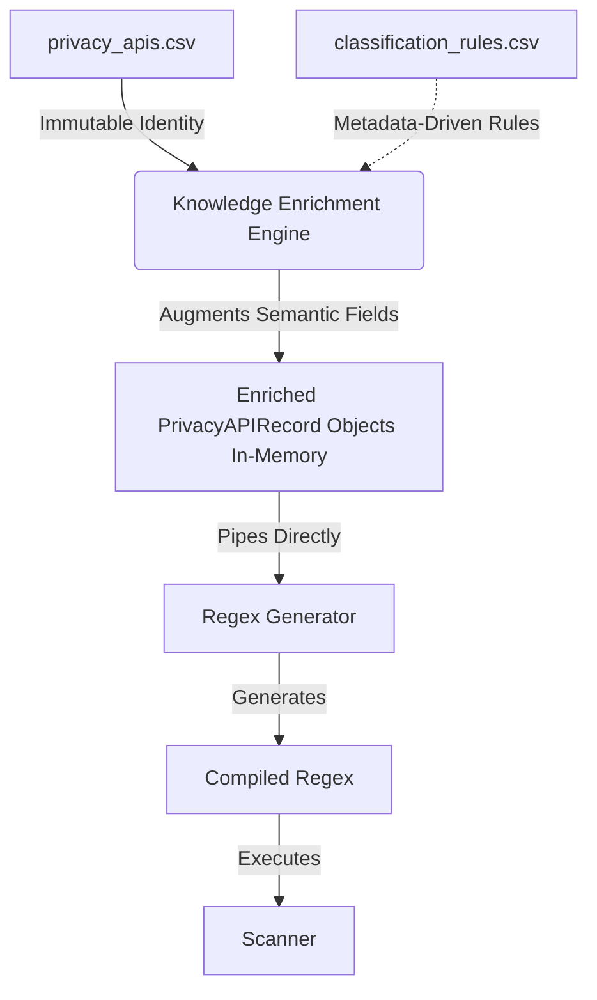

# Knowledge Enrichment Engine: Architecture & Design (Final Freeze)

## 1. Project Motivation
The Knowledge Acquisition layer successfully merged diverse vulnerability datasets (Axplorer, PScout, and Google Play Services) into a single deterministic, canonical database (`privacy_apis.csv`). However, this canonical database represents *raw provenance*—it lacks comprehensive semantic meaning. Many APIs possess an "Unknown" privacy category because the canonicalization phase strictly avoided guessing or inferring metadata. 

The **Knowledge Enrichment Engine** bridges this gap. Its sole purpose is to deterministically augment existing APIs with high-fidelity semantic metadata (such as standardized privacy categories, subcategories, documentation links, and refined confidence scores). This process must be entirely metadata-driven, fully reproducible, strictly hierarchical, and explicitly disjoint from the pipeline's core canonical identity.

## 2. Simplified In-Memory Architecture Diagram



## 3. Persistent Canonical Identity (No Derived Databases)
- **Input Database**: `knowledge_base/processed/privacy_apis.csv` (Treated as 100% immutable read-only input).
- **Rule Metadata**: `knowledge_base/metadata/classification_rules.csv` (The single source of truth for semantic intelligence).
- **Output**: **In-Memory Objects Only**. 

*Justification*: The architecture must explicitly enforce that `privacy_apis.csv` is the ONLY canonical database. Derived outputs are inherently ephemeral and can be generated instantly. Persisting an "enriched" database violates the single-source-of-truth paradigm and creates synchronization hazards. The pipeline will hold enriched objects purely in-memory and yield them directly to the Regex Generator.

## 4. Immutable vs. Enrichable Fields

### Immutable Fields (The Canonical Identity)
The following fields constitute the API's unique cryptographic identity and MUST NEVER be mutated by the Enrichment Engine:
- `record_id`
- `framework`
- `package_name`
- `class_name`
- `method_name`
- `api_type`
- `sources`, `source_versions`, `import_timestamp` (Provenance)

### Enrichable Fields (The Semantic Context)
The engine is explicitly authorized to append or overwrite the following fields in memory:
- `category` & `subcategory`: Translated into a standardized privacy taxonomy.
- `documentation_url`: Link to official Android/GMS documentation.
- `notes`: Enrichment annotations or heuristic rationales.
- `confidence`: Adjusted based on rule metadata (e.g., VERY_HIGH, HIGH, MEDIUM, LOW).
- `aliases`: To map heavily overloaded wrappers (if applicable).

## 5. Unified Classification Rule System

Enrichment will be **Metadata-Driven**, operating exclusively out of a single file: `classification_rules.csv`.

*Justification*: A single rule file vastly improves maintainability. Researchers no longer need to manage four disjoint CSVs to classify an API. The entire heuristic engine can be viewed, filtered, and managed in one tabular schema.

### Schema (`classification_rules.csv`)
| Column | Description |
|---|---|
| `level` | `method`, `class`, `package`, or `keyword` |
| `pattern` | The string matching the specified level (e.g. `android.location` or `getLatitude`) |
| `category` | Target privacy category (e.g. `Location`) |
| `subcategory` | Target privacy subcategory (e.g. `GPS`) |
| `confidence` | The assigned rule confidence (e.g. `VERY_HIGH`) |
| `notes` | Research justification |

## 6. Rule Priority & Conflict Resolution

### Rule Priority (Specificity Wins)
The Engine dynamically sorts all entries from `classification_rules.csv` into a strict Top-Down specificity cascade:
`Method Rule > Class Rule > Package Rule > Keyword Rule > Existing Metadata`

An exact `method` match will unconditionally override a broader `class` match.

### Conflict Resolution Strategy
- **Inter-Level Conflicts**: Inherently resolved by priority cascade (e.g., Method rules always win over Package rules).
- **Intra-Level Conflicts**: If two rules *at the exact same hierarchical level* contradict one another (e.g., a regex keyword `getLocation` matches "Location" but another keyword `getDeviceLocation` matches "Device ID"), the engine will:
  1. Abort enrichment for that specific field (retaining its baseline canonical state).
  2. Log a `WARNING` flag directly into the API's `notes` array.
  3. Emit the collision to `enrichment_validation_report.md` for manual research review.

## 7. Validation Strategy

A standalone `validate_enrichment.py` will guarantee pipeline integrity against the in-memory stream:
1. **Identity Preservation**: Asserts that every `record_id` from the canonical input perfectly matches the output, ensuring 0 APIs were lost, injected, or modified.
2. **Taxonomy Enforcement**: Asserts that every assigned `category` strictly belongs to the pre-approved `privacy_categories.csv` taxonomy.
3. **Conflict Tabulation**: Verifies that unresolved intra-level conflicts were successfully logged without artificially corrupting the state.

## 8. Folder Structure (Proposed)

```text
knowledge_base/
├── metadata/
│   └── classification_rules.csv
├── pipeline/
│   ├── enrich_database.py
│   └── validate_enrichment.py
```

## 9. Design Decisions Summary
This design ensures the pipeline remains entirely deterministic and memory-efficient. By consolidating all rules into `classification_rules.csv` and refusing to cache derived datasets, the architecture drastically reduces file I/O overhead and synchronization bugs. Extending the engine to handle new SDKs simply involves adding new rows to the unified rule CSV—zero changes to the underlying Python logic will be required. 

This model satisfies the rigid constraints of the project, completely eliminates persistent intermediate states, and prepares an immutable, highly scalable integration for Regex Generation.

## 10. Relationship to PCAP Network Knowledge Base

The Knowledge Enrichment Engine described above applies exclusively to the **Static Analysis Knowledge Base** (enriching Smali bytecode findings). 

For the **PCAP Network Knowledge Base**, enrichment is handled dynamically at runtime via the `NetworkContext` and its specialized matchers (`TrackerMatcher`, `GeoMapper`, `DNSResolverMatcher`, `PIIMatcher`). The PCAP pipeline does not use an in-memory rule-cascade engine; instead, its processed datasets (e.g., `trackers.csv`, `dns_resolvers.csv`) are already fully semantically enriched during their respective offline build phases and are loaded directly into specialized lookup structures (like `SuffixMatcher` or direct dictionaries).
