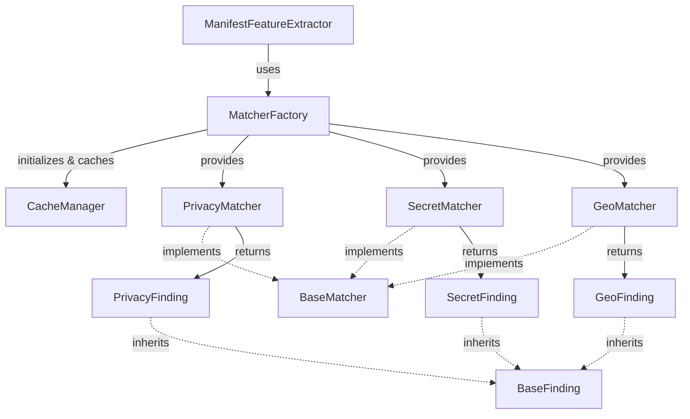
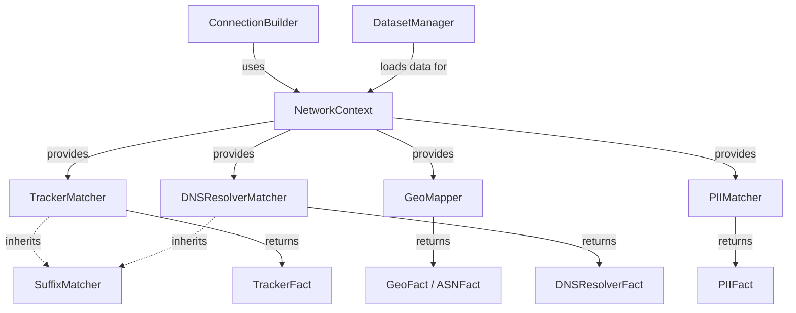

# Matcher Architecture
## Unified Matcher Framework

### Architecture Diagram

### Lifecycle & Initialization
1. **Orchestration**: During startup, `MatcherFactory.initialize()` is called exactly once.
2. **Initialization**: The factory pulls `PrivacyMatcher`, `SecretMatcher`, and `GeoMatcher`. Each matcher immediately triggers `initialize()` to safely build their underlying pattern detectors (e.g., Aho-Corasick automaton, Regex sets).
3. **Caching**: Memory-intensive resources like the loaded automata, Regex engines, and statistical maps are globally cached using `CacheManager`.
4. **Invocation**: `ManifestFeatureExtractor` pulls pre-warmed singletons directly via `factory.privacy()`, guaranteeing zero runtime construction overhead per scan.

### BaseMatcher Implementation
The `BaseMatcher` interface ensures structural guarantees across:
- `initialize()`: Safely populate engines.
- `search(text)`: O(N) evaluation over targets returning strictly typed schema lists (inheriting `BaseFinding`).
- `statistics()`: Insight tracing for debugging.
- `close()`: Resource teardown when scaling architectures require explicit GC collection.

### Design Rationale
Previously, detectors evolved sequentially resulting in fractured schema outputs, un-orchestrated initialization events, and duplicated I/O loading patterns.
The new unified architecture resolves this by wrapping all detection primitives inside the centralized `MatcherFactory`.

The scanner architecture is now **production-ready** and permanently **FROZEN**.

## PCAP Network Matchers

While the Static Analysis matchers use the singleton `MatcherFactory`, the PCAP Network Knowledge Base uses a dependency-injection architecture via `NetworkContext`.

### PCAP Architecture Diagram

### PCAP Matcher Lifecycle
1. **Orchestration**: `DatasetManager` loads frozen processed datasets (e.g., `trackers.csv`, `pii_patterns.csv`) from disk.
2. **Initialization**: The PCAP matchers (`TrackerMatcher`, `GeoMapper`, `DNSResolverMatcher`, `PIIMatcher`) are instantiated and injected into `NetworkContext`.
3. **Invocation**: `ConnectionBuilder` applies these matchers per connection flow to augment `ConnectionRecord` objects with deterministic factual metadata (`TrackerFact`, `GeoFact`, etc.).
4. **Caching**: Matchers like `TrackerMatcher` utilize internal LRU caching (e.g., `@functools.lru_cache`) to optimize repeated lookups across high-volume network streams.
